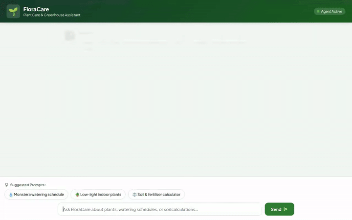

# FloraCare — Plant Care & Greenhouse Assistant

FloraCare is an intelligent conversational AI assistant built on the Agent Development Kit (ADK) and Google Cloud Vertex AI. It empowers plant enthusiasts and indoor gardeners to manage house plant care schedules, search plant catalogs, calculate custom soil and fertilizer requirements, monitor local weather conditions, locate nearby plant nurseries, and generate synthetic plant images and video demonstrations.



---

## Key Capabilities & Implemented Tools

FloraCare incorporates the following tools and capabilities:

- **Plant Catalog & Care Requirements**:
  - `search_plant_catalog`: Queries Firestore for matching indoor plants based on light level, care difficulty, and watering frequency.
  - `lookup_plant_care`: Retrieves detailed care instructions (light, humidity, soil type, toxicity, watering) for specific plants.
  - `add_plant_to_catalog`: Allows adding new plant varieties into the central Firestore catalog database.

- **Watering & Soil Calculations**:
  - `check_watering_schedule`: Calculates when a plant requires its next watering based on last watered date and plant-specific intervals.
  - `calculate_soil_and_fertilizer`: Computes pot volume, soil requirements, and NPK fertilizer dilution ratios based on pot height and diameter.

- **Environmental & Geospatial Integrations**:
  - `get_local_plant_environment`: Fetches real-time outdoor temperature, humidity, and weather conditions via the Open-Meteo API.
  - `geocode_address`: Converts physical addresses or city names to latitude/longitude coordinates via OpenStreetMap Nominatim.
  - `find_nearby_places`: Locates nearby plant nurseries, garden centers, and plant shops using the Google Places API.

- **Generative Media**:
  - `generate_plant_image`: Generates high-quality plant photos using Vertex AI **Imagen 3** (`imagen-3.0-generate-002`), saving session artifacts and uploading directly to Google Cloud Storage.
  - `generate_plant_video`: Generates short video clips of plant scenes using Google's **Gemini Omni Model** (`gemini-omni-flash-preview`), saving session artifacts and uploading directly to Google Cloud Storage.

- **Cross-Session Memory & Safety**:
  - **Vertex AI Memory Bank Service**: Persists user preferences, plant allergies, pet safety constraints, and home lighting conditions across sessions.
  - **Structured UI (A2UI v0.8)**: Emits clean, declarative A2UI JSON components (`Card`, `Column`, `Row`, `Text`, `Image`) rendered directly in the web client.

---

## Google Cloud Architecture & Services

- **Vertex AI Agent Engine (ADK Framework)**: Core reasoning runtime running `gemini-2.5-flash` with structured system instructions and callback handlers.
- **Vertex AI Memory Bank**: Centralized long-term memory store for user profile constraints.
- **Google Cloud Firestore**: NoSQL persistence for the plant catalog database.
- **Google Cloud Storage (GCS)**: Public media asset storage bucket for generated plant images and videos.
- **Vertex AI Imagen 3 & GenAI Omni Models**: Multimodal media generation engines.
- **Google Cloud Run**: Containerized deployment target for the agent backend and proxy frontend.

---

## Local Development & Setup Instructions

### Prerequisites
- Python 3.11+
- Node.js & `uv` package manager
- Authenticated `gcloud` CLI (`gcloud auth application-default login`) with access to Google Cloud project.

### 1. Install Dependencies
```bash
# Install Python dependencies using uv
uv sync
```

### 2. Start Local Frontend Server
Set the required environment variables and launch the FastAPI server from the `frontend/` directory:

```bash
cd frontend

AGENT_ENGINE_RESOURCE_NAME="projects/<PROJECT_ID>/locations/<REGION>/reasoningEngines/<RESOURCE_ID>" \
AGENT_DIRECTORY="app" \
PORT=8080 \
uv run python main.py
```

The web interface will be accessible locally on port 8080.

---

## Running the Demo Recorder

To record an automated screen capture demo of the agent with Playwright and Google Lyria background music:

```bash
NODE_PATH=./node_modules \
PATH="./node_modules/ffmpeg-static:./node_modules/ffprobe-static/bin/linux/x64:$PATH" \
GOOGLE_CLOUD_PROJECT="<PROJECT_ID>" \
node .agents/skills/record-demo/record-agent.js \
  --url http://localhost:8080/ \
  -q "How often should I water my Monstera Deliciosa?" \
  -q "Look up the care details for Peace Lily and generate an image of it." \
  --wait 35000 \
  --speed 1.5 \
  --music "upbeat lo-fi chill hip-hop, acoustic guitar, relaxed downtempo drums, warm cheerful vibe" \
  -o agent_demo.webm
```
